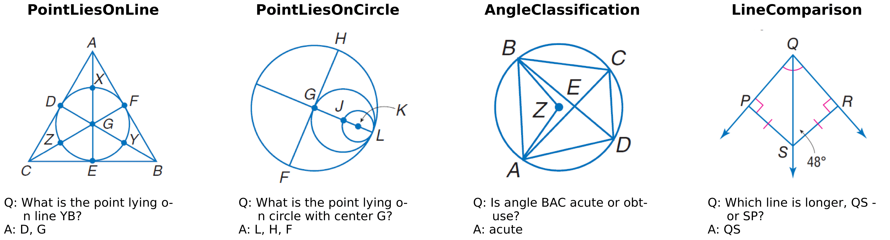
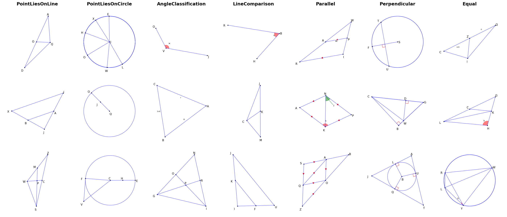

<p align="center">
  
  <h1 align="center" style="margin-top: -20px;">Supercharging Multimodal LLMs with Synthetic High-Fidelity Visual Descriptions</h1>
</p>

<p align="center">
  
</p>

<div style="font-family: charter;" align="center">
    <a href="https://saccharomycetes.github.io/" target="_blank">Jiarui Zhang</a>,
    <a href="https://ollieliu.com/" target="_blank">Ollie Liu</a>,
    <a href="https://github.com/yiranyyu" target="_blank">Tianyu Yu</a>,
    <a href="https://jameshujy.github.io/" target="_blank">Jinyi Hu</a>,
    <a href="https://willieneis.github.io/" target="_blank">Willie Neiswanger</a>
</div>

A study of low-level geometric understanding of multimodal LLMs including:

- A focused benchmark (Geoperception)
- Empirical studies on the MLLM design space
- Models (Euclid) with strong low-level geometric understanding abilities

## Updates
- [12/05/24] 🔥 Euclid paper is released! We also release our dataset generation engine and training scripts.


## Installation

```
conda create -n euclid python=3.10 -y
conda activate euclid
pip3 install --upgrade pip
pip3 install -e .
pip3 install flash-attn --no-build-isolation
```
## Contents

- [Dataset Preparation](#dataset-preparation)
- [Empirical Study](#empirical-study-example-script)
- [Euclid Training](#euclid-training)

## Geometry Image Generation Engine

[training_data_engine.py](./image_engine/training_data_engine.py) produce geometry images, questions, and answers for model training, with the following components:
- [produce_shape.py](./image_engine/produce_shape.py) contains our carefully designed geometry shapes for empirical study and Euclid training.
- [question_engine.py](./image_engine/question_engine.py) takes the geometry shapes as input and generate the questions and corresponding answers for training and testing.
- [alphageometry](./image_engine/alphageometry) convert the logical geometry shapes into pixel-level images, which is bulit based on [AlphaGeometry](https://github.com/google-deepmind/alphageometry).

### Testing Data for Empirical Study
```
from image_engine.training_data_engine import *

tasks = ['PointLiesOnLine_empirical', 'LineComparison_empirical']
stages = [1, 2, 3]

data_engine = Euclid_DataEngine(tasks=tasks, stages=stages, attenuation_rate=0, image_path='./playground/data/testing_data/image', tol=0.3)

datas = data_engine.generate_datas(6000)

with open('./playground/data/testing_data/data.json', 'w') as f:
    json.dump(datas, f, indent=4)
```

### Testing Data for Euclid Training
```
from image_engine.training_data_engine import *

tasks = ['PointLiesOnLine', 'PointLiesOnCircle', 'AngleClassification', 'LineComparison', 'Parallel', 'Perpendicular', 'Equal']
stages = [1, 2, 3]

data_engine = Euclid_DataEngine(tasks=tasks, stages=stages, attenuation_rate=0, image_path='./playground/data/euclid/image', tol=0.3)

datas = data_engine.generate_datas(10500)

with open('./playground/data/euclid/data.json', 'w') as f:
    json.dump(datas, f, indent=4)
```

<p align="center">
  <h3>Training Dataset Examples Generated by Our Engine</h3>
  
</p>

## Scripts for Empirical Study and Euclid Training

### Empirical Study Example Script

```
bash scripts/empirical_study/run.sh
```

### Euclid Training Example Script 
Training Euclid-ConvNeXt-Large takes around 16 hours on a single A100-80GB GPU, and training Euclid-ConvNeXt-XXL takes around 24 hours on a single A100-80GB GPU. 

```
bash scripts/euclid_training/run.sh
```

Important Training Arguments:
- `--tune_vision_tower`: Whether to finetune the vision tower.
- `--language_model`: The language model to be used. Currently, we support [Qwen-2.5](https://huggingface.co/collections/Qwen/qwen25-66e81a666513e518adb90d9e) and [Qwen-2](https://huggingface.co/collections/Qwen/qwen2-7b-instruct-8192) series.
- `--vision_tower`: The vision tower to be used. Currently, we support 
  - **clip_336**: [openai/clip-vit-large-patch14-336](https://huggingface.co/openai/clip-vit-large-patch14-336)  
  - **clip_224**: [openai/clip-vit-large-patch14](https://huggingface.co/openai/clip-vit-large-patch14)  
  - **dino_giant**: [facebook/dinov2-giant](https://huggingface.co/facebook/dinov2-giant)  
  - **dino_large**: [facebook/dinov2-large](https://huggingface.co/facebook/dinov2-large)  
  - **siglip_384**: [google/siglip-so400m-patch14-384](https://huggingface.co/google/siglip-so400m-patch14-384)  
  - **siglip_224**: [google/siglip-so400m-patch14-224](https://huggingface.co/google/siglip-so400m-patch14-224)  
  - **conv_large**: [laion/CLIP-convnext_large_d_320.laion2B-s29B-b131K-ft-soup](https://huggingface.co/laion/CLIP-convnext_large_d_320.laion2B-s29B-b131K-ft-soup)  
  - **conv_xxlarge**: [laion/CLIP-convnext_xxlarge-laion2B-s34B-b82K-augreg-soup](https://huggingface.co/laion/CLIP-convnext_xxlarge-laion2B-s34B-b82K-augreg-soup)  
  - **vit_g**: [laion/CLIP-ViT-g-14-laion2B-s34B-b88K](https://huggingface.co/laion/CLIP-ViT-g-14-laion2B-s34B-b88K)  
  - **vit_h**: [laion/CLIP-ViT-H-14-laion2B-s32B-b79K](https://huggingface.co/laion/CLIP-ViT-H-14-laion2B-s32B-b79K)
- `--tasks`: The tasks of the empirical study, containing:
  - **PointLiesOnLine**
  - **LineComparison**
  - **PointLiesOnCircle**
  - **AngleClassification**
  - **Parallel**
  - **Perpendicular**
  - **Equal**
  - **PointLiesOnLine_empirical** (for empirical study only)
  - **LineComparison_empirical** (for empirical study only)
- `--stages`: The stages of the empirical study, for all tasks we have 3 stages currently.
- `--attenuation_rate`: Set to 0 for static (single stage or mixed) training in empirical study, set to 1.5 (default) for curriculum learning.


## Acknowledgements
[LLaVA](https://github.com/haotian-liu/LLaVA): The codebase that our training framework is built on.

[AlphaGeometry](https://github.com/google-deepmind/alphageometry): The codebase that our dataset generation engine is built on.

[Openclip](https://github.com/mlfoundations/open_clip): The codebase containing the pre-trained visual encoders that we used for our experiments.
